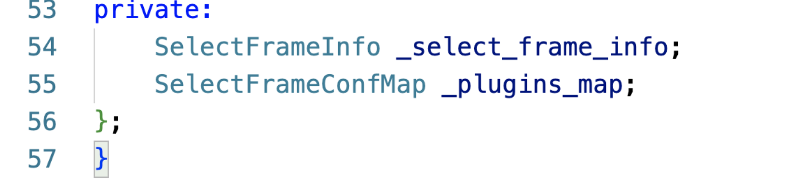
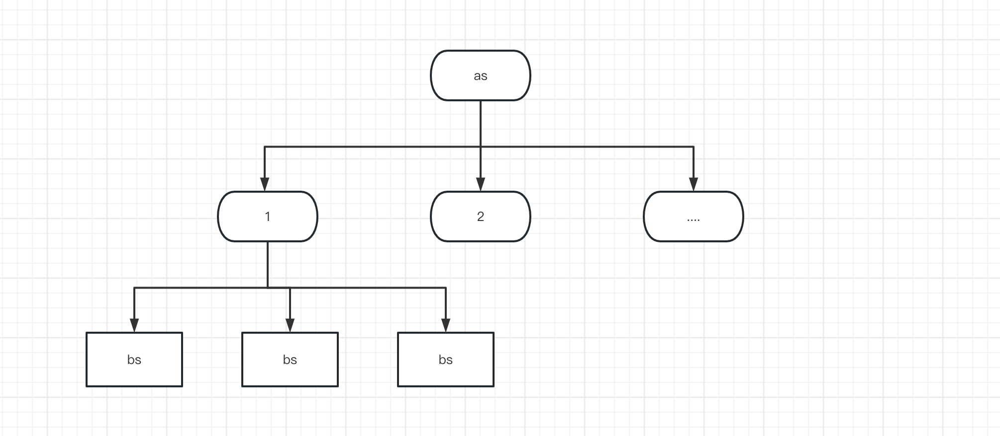
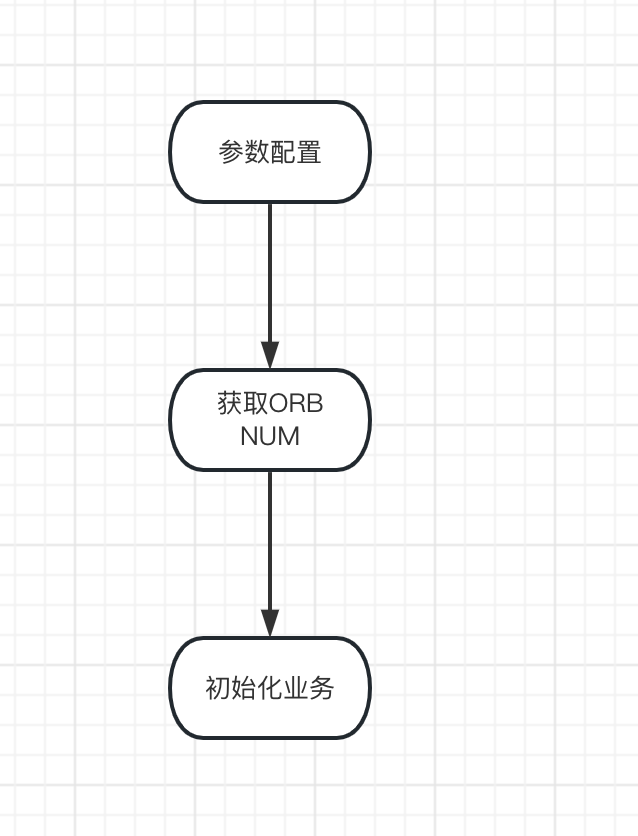
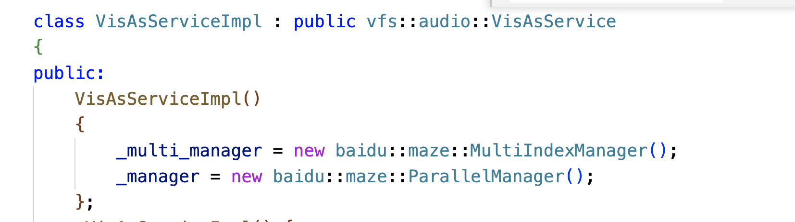
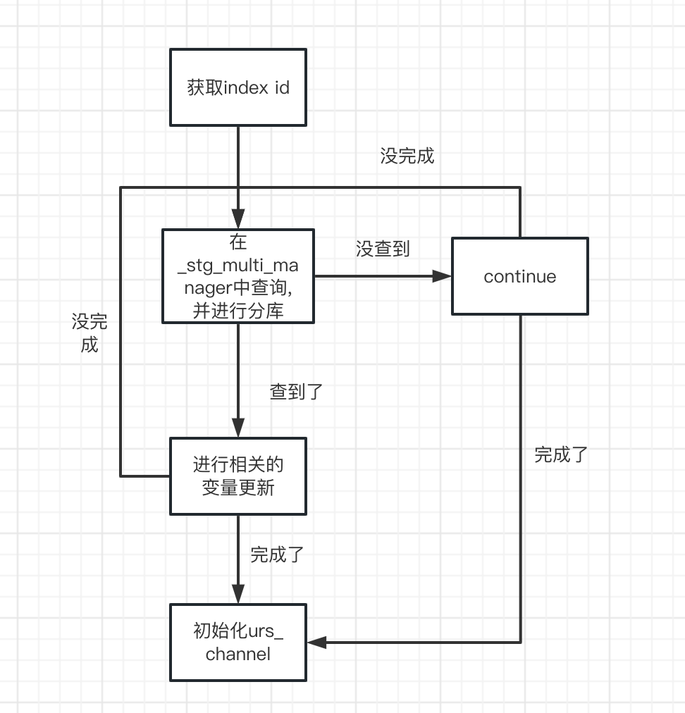
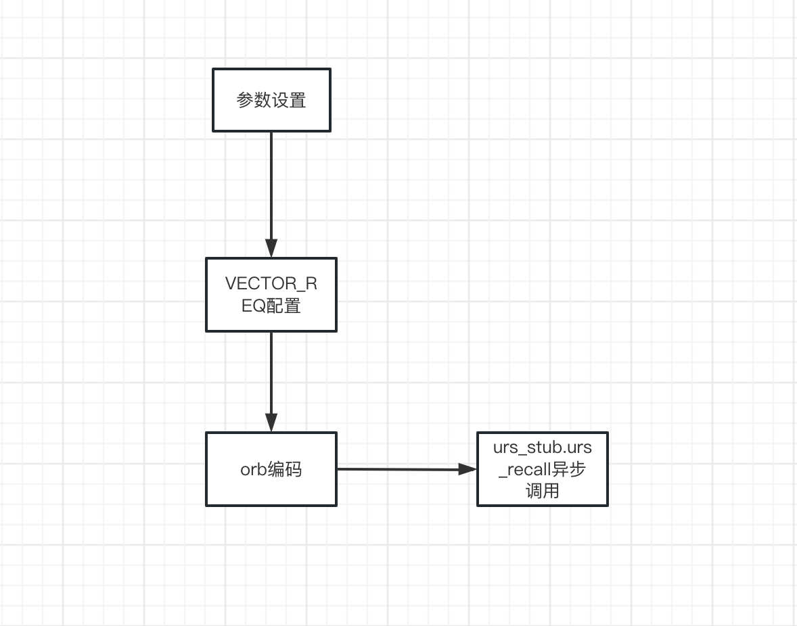
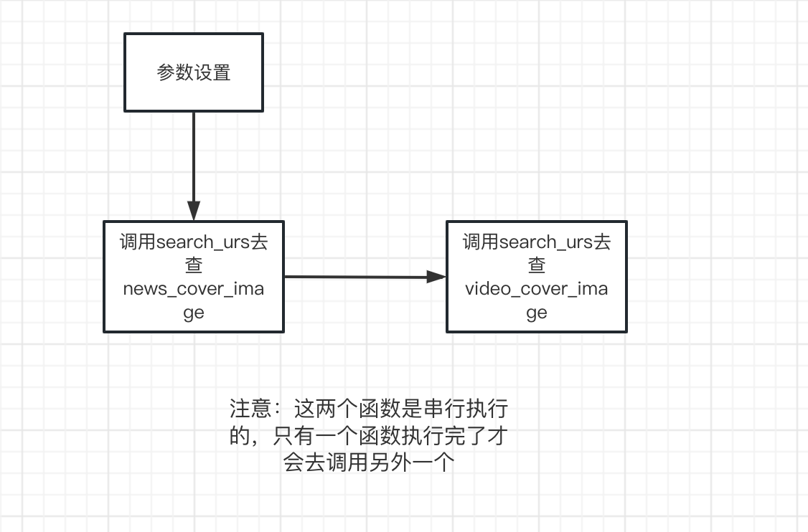
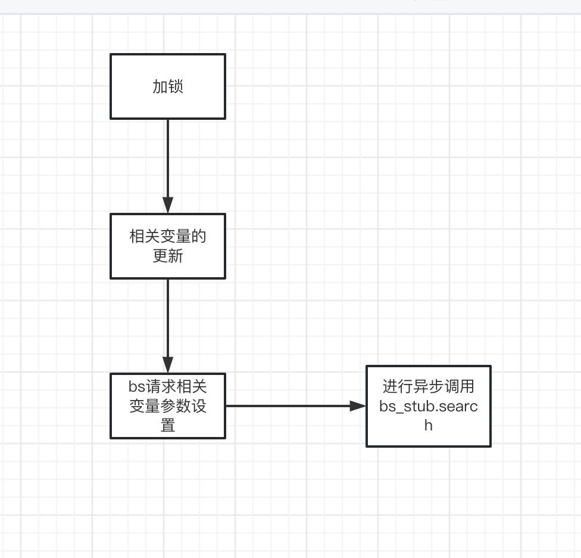

# phantom-server

# s

| 模块         | 作用                               |
| ------------ | ---------------------------------- |
| select_frame | 选择frame，并且进行配置frame的参数 |
| parse_as     |                                    |
|              |                                    |
|              |                                    |
|              |                                    |
|              |                                    |
|              |                                    |
|              |                                    |
|              |                                    |
|              |                                    |
|              |                                    |
|              |                                    |
|              |                                    |

# select_frame

## 数据成员

## process主体思路

首先利用map进行排序， 然后配置frame的参数

# access_sven_as

## 数据成员

# 参考链接

https://ku.baidu-int.com/knowledge/HFVrC7hq1Q/pmquNWcpSA/KZD1A4u2_x/wYZojGaLozKMdj

召回什么意思（检索比较相似的结果）

过滤（filter_frame_num，如果为2，含义为如果相似的图片大于两个，则相似的图片数目超过2个，则不允许） 

 翻转（flip），图片翻转

黑库：识别指定敏感图片、视频、文本、音频

短带长：从小视频检索出类似的长视频全集

afs:分布式文件系统，存储离线资源

# vs相似结果（SimiResult ）

相似片段（用vector来存储）

标题、文本相似得分

思路：

1. 先获取阈值（如果有就用传来的）

2. 配置filter参数
3. 查看相似的
4. 排序
5. 跟0比较

# as模块

使用的特征提取算法：orb和cnn

## 相关配置

/home/disk3/suichunyu/as_read/baidu/feed-cv/audio-as/noahdes/value

## 作用

## 整体架构图

1 2 是分库，访问分片

## 详细流程图（代码流程）

## VisAsServiceImpl流程

## 数据成员

baidu::maze::MultiIndexManager

baidu::maze::ParallelManager

### MultiIndexManager 

### MultiIndexManager::batch_search_async

（不对），相关变量更新，怎么通过index_id请求bs？

 

### MultiIndexManager::search_urs

### MultiIndexManager::search_urs_cover

## ParallelManager

### ParallelManager::batch_search_async

加锁错了，去掉

urs?urs_stub.urs_recall

# bs模块

## audio_bs::SimiBsServiceImpl

### SimiBsServiceImpl::search

设置参数下面缺  检索逻辑

没到max_search_orb_num  这个没有

# 潜在问题

哪些需要访问rts？

micro_video: 1

小程序：0

产出字段写到物料库

指纹写了什么字段（哪里）

as无序列级别查重，聚合bs

as必须有2帧相似以上才会被召回

rts实时库，有效期多长

| 流程                | 作用                                                         |
| ------------------- | ------------------------------------------------------------ |
| **phantom-server**  | 指纹系统通用入口模块，输入请求字段包括nid、video_url、req_from等，调用vs-search |
| **vs-search**       | phontom-server将检索请求发送到vs中，输入为cr_request，包括视频vid、url等，输出为相似性列表，包括召回nid、simi_score等。vs请求feature_service获取cnn+orb特征，然后用分帧特征去请求as模块，对as模块返回的帧级别结果进行合并和计算相似性得分并根据阈值过滤，得到最终的相似性列表返回给phantom_server。 |
| **feature_service** | 收到vs请求后，会先检索缓存和特征库，未命中的话，就去访问cnn-service计算特征，cnn-service通过下载、抽帧、计算特征等过程将特征返回给feature-service。 |
| **as聚合检索**      | 聚合检索模块，输入是帧级别的特征，根据分库策略并行的请求分库bs分片和实时库rts（通过请求maze-master得到分片ip和端口），对召回的结果进行合并并返回给vs。 |
| **bs基础检索**      | 基础检索模块，输入是帧级别的特征，根据cnn特征通过HNSW分层索引进行检索，并根据orb特征校验，最终将召回帧结果返回给as。对应的实时库rts采用暴力检索或者puck计算。 |

